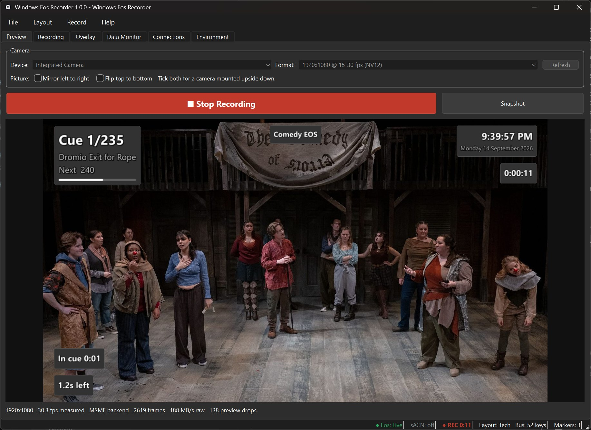

# Wer: Windows Eos Recorder

Wer records a live camera feed with an ETC Eos-family console's data burnt
into the picture: cue number and label, the command line, the channels being
worked on. It is for a lighting designer or programmer who wants a recording
of a tech that stays useful afterwards, not a phone video of a dark stage.



Windows only. Version **1.0.0**. Free software under the GPL v3 or later.
**Download:** the installer for the current version is on the
[Releases page](https://github.com/hudcolighting/wer/releases/latest);
there is nothing else to install. See [Installing](#installing).

## What it does

**The picture.** A camera runs from the moment the app opens and keeps
running through a take, so there is no start button to forget: 1080p30 in
MJPG where a camera offers it, UYVY from a capture card.

**The data.** One Eos-family desk (Eos, Ion, Nomad) over OSC -- outbound TCP
to port 3032 by default, or UDP -- parsed into the live cue's number, list,
label and fade, the command line per user, channels, softkeys and show name.

**The overlay.** Seven kinds of widget -- text, cue block, fade bar,
time-in-cue, status lamp, picture and panel -- anchored to nine points with
offsets in fractions of the frame: a 1080p layout is the same size at 4K.
Thirty ready-made widgets and ten layouts ship, hotkey-switched, saved as JSON.
A new show opens with three of them: Tech, Minimal and None.

**The recording.** H.264 into MKV (the default; it survives a crash) or
fragmented MP4, with four quality presets. Hardware encoders are tested at
launch, each recording a frame into a real file, and failures show why. The
sound's offset against the picture is kept for each camera and input, typed
on the **Recording** tab or measured by **Clap test…** from a recorded clap.

**Markers.** By hand (Ctrl+M, with a note), on every cue the desk fires, or
with a snapshot. They go into the video as chapters; an MKV also carries the
marker list and a log of everything the console sent, as attachments.

**When things go wrong.** A take survives ffmpeg dying (it continues into a
numbered part), a camera being unplugged (it reopens into the same file) and
a disk filling (it stops with room to close the file). An input delivering
half its sound, or digital silence, is reported in the status bar mid-take.

**Remote control.** Nine commands -- record, stop, toggle, snapshot, marker,
layout by name, next layout, hide and show the overlay -- that a macro on the
desk sends down the connection Wer already has to it.

**Recording status over sACN.** Off by default: one address (universe 101,
address 1 to start) sits at 0 while Wer is idle and pulses to full and back
every two seconds while recording, by multicast on the card you pick or the
one Windows prefers, with per-address priority on so receivers that honour
it leave the rest alone.

## What you need

- Windows 10 or 11. Other versions are untested.
- A camera Windows can see.
- For console data, an Eos-family desk or ETCnomad running 2.x or 3.x,
  reachable over the network with OSC output switched on. Everything else
  works without one.
- For sound, a DirectShow audio input -- a capture device's own audio, or a
  USB interface. Webcam microphones will do for trying things out.
- Nothing else. Python, Qt and ffmpeg are all inside the build.

## Installing

Download `Wer-<version>-setup.exe` from the [Releases
page](https://github.com/hudcolighting/wer/releases/latest), or use the one
you were handed, and run it: a per-user install into
`%LOCALAPPDATA%\Programs\Wer`, with no administrator prompt on a locked-down
venue machine and an entry in Add/Remove Programs. Wer is not code-signed, so
Windows warns about an unsigned application the first time -- **More info**,
then **Run anyway** -- and where Smart App Control is on an unsigned build can
be refused outright. The alternative is the zip: unzip it and run `Wer.exe`.

Settings live in `%LOCALAPPDATA%\Wer`, the log beside the exe in
`logs\wer.log` (or under `%LOCALAPPDATA%\Wer` if that is not writable), and
recordings in `%USERPROFILE%\Videos\Wer`. Uninstalling leaves settings and
recordings alone, and takes the log folder beside the exe with it.

## First run

- **The preview takes a few seconds.** The camera waits for the format probe
  and the audio check; encoder detection runs once the picture is up.
- **Sound starts on Windows' default input.** Change it on the **Recording**
  tab; whatever is chosen there, None included, is kept from then on.
- **The console is off until you set one up.** **Connections → Eos**: type an
  address and press Connect, or use **Find a console**. The default is an
  outbound TCP connect to port 3032, which needs no firewall rule. A console
  that has sent data is remembered and reconnected on the next launch.
- **Press F1.** The help is seventeen searchable topics, partly generated
  from the code, so the widget and command lists cannot go stale.

## Building from source

You need **Python 3.12 x64** and git, and a checkout **outside OneDrive**,
which will otherwise try to sync `.venv`, `build/` and `dist/`.

```powershell
git clone https://github.com/hudcolighting/wer.git C:\dev\wer
cd C:\dev\wer
py -3.12 -m venv .venv
.\.venv\Scripts\python.exe -m pip install -r requirements-dev.txt
.\.venv\Scripts\python.exe -m pip install -e . --no-deps
.\tools\fetch-ffmpeg.ps1    # pinned ffmpeg, SHA256 checked; not committed
.\.venv\Scripts\python.exe -m wer      # run it from the source tree

.\build.ps1                  # one-folder dev build -> dist\Wer\Wer.exe
.\build.ps1 -Installer       # setup.exe to hand over (needs Inno Setup)
.\build.ps1 -Package         # the same payload, zipped instead
.\build.ps1 -Release -Clean  # one-file exe -> dist\Wer.exe
.\build.ps1 -Force           # stop a running Wer.exe rather than refusing
.\build.ps1 -Run             # build, then launch
```

Hand out the installer or the zip, not the one-file exe: both keep the Qt
DLLs loose in `_internal\PySide6\` and replaceable, as the LGPL requires.

## Tests

```powershell
.\.venv\Scripts\python.exe -m pytest
```

Several tests drive the real bundled ffmpeg and pace frames into it, so a full
run takes minutes; run `fetch-ffmpeg.ps1` first or those skip. The suite builds
a real QApplication and wants a desktop session. The two tests that record from
a real audio input skip unless `WER_LIVE_AUDIO_INPUT` names one. There is no CI.

## How it is put together

```
src/wer/
  core/         no Qt.  DataBus, show file, markers, bus log, A/V offsets
  connections/  no Qt.  Eos over OSC, console search, commands from the desk,
                        sACN status out, network adapters, clock, typed fields
  video/        no Qt.  capture, encoders, recorder, chapters, snapshots,
                        device enumeration, clap test analysis
  overlay/      Qt.     widgets, compositor, layouts and the ready-made sets
  ui/           Qt.     application chrome
```

`core`, `connections` and `video` must import with no Qt in the process, so
the protocol parsers stay testable headlessly; `tests/test_architecture.py`
enforces it. Connections publish to the DataBus and widgets subscribe to it.

## Limitations

- No sACN input, no Art-Net and no MIDI. Console data arrives only as OSC
  from an Eos-family desk, and sACN only goes out.
- No control of the desk: the only bytes Wer sends it are a user binding and
  a subscribe request when it connects.
- SLIP framing on port 3033 is implemented and searched for, but has never
  been seen to answer. TCP 3032 in OSC 1.0 framing is the proven path.
- An MP4 take cannot be self-contained: it gets its chapters, but MP4 holds
  no attachments, so the marker list and bus log stay beside it as files.
- Markers only exist inside a take. Ctrl+M when idle says so.
- Only the first nine layouts get a Ctrl+number hotkey and a place in the
  Layout menu; the rest are on Ctrl+L, the **Overlay** tab, or by name.
- Nothing looks at the picture: a camera delivering flat black at full rate
  is not a fault, because a blackout is black too.
- A second copy of Wer runs but cannot save settings, and says so.
- Remote control has been measured only over TCP, and against Eos running as
  software rather than a hardware desk. The sACN output has not been tried
  through a gateway, or beside a console sending the same universe.
- Multi-part cues, and shows running more than one cue list, have not been
  observed. The overlay shows whatever list the address carried.

## Problems and patches

Send problems to **wer@hudco.lighting** with `wer.log` attached (**Help →
Open Log Folder**), what you were doing, and the version and build from the
**Environment** tab. There is no issue tracker. For patches read
[CONTRIBUTING.md](CONTRIBUTING.md) first -- there is a contributor licence
agreement -- and ask before starting anything larger than a fix.

## Licence

Wer is free software under the **GNU General Public License, version 3 or
later**. Copyright © Hudco Lighting LLC; see [LICENSE](LICENSE). It bundles
**FFmpeg 8.1.2** unmodified, itself GPL v3, so one licence covers the whole
distribution; Qt is used under the **LGPL v3** with its DLLs shipped loose so
they can be replaced. [THIRD-PARTY-NOTICES.md](THIRD-PARTY-NOTICES.md) names
every bundled component and its licence. Anyone handed a build is entitled to
the source: Wer's at <https://github.com/hudcolighting/wer>, tagged per
release, and FFmpeg's at <https://ffmpeg.org/releases/ffmpeg-8.1.2.tar.xz>.

## Status

1.0.0 is the first release. It has been installed and used to record on both
Windows 10 and Windows 11, including a machine with no hardware encoder, where
it recorded 1080p30 on software encoding.
